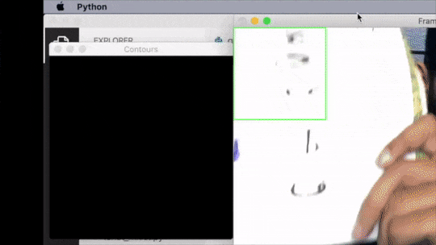

# Urdu Alphabet (حروف تہجی) Handwritten Letters Recognizer
### Recognition of Urdu Handwritten Letters Using Convolutional Neural Network


Urdu is one of the cursive languages that is widely spoken and written in the regions of South-East Asia including
Pakistan, India, Bangladesh, Afghanistan, etc.

There are `39 alphabets` in Urdu language, This Experiment is done using `175500 images`, each letter contains `4500 images`,
The dimension of the image is `1x50x50x1`.
## Demo


## Install
```
  git clone https://github.com/ranahaani/htlr.git
  cd htlr
  pip install -r requirements.txt
```
## Download dataset
CSV dataset is available on [Google Drive Link](https://drive.google.com/file/d/1I403DK_nT3h-heM83EuYCcRrY7cQUWoz/view?usp=share_link).

You can download images dataset on Kaggle

``` bash
kaggle datasets download -d ranahaani/htlr-dataset
```


# Requirements

* python
* numpy 
* matplotlib 
* sklearn
* tensorflow 
* keras


## Usage
```
# To Train
python htlr.py --save-model 1 --weights output/htlr.hdf5
python htlr.py --load-model 1 --weights output/htlr.hdf5
```

## License
[MIT](https://choosealicense.com/licenses/mit/)